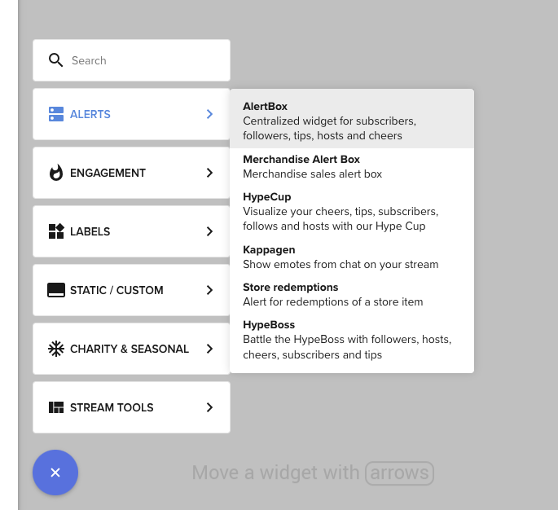
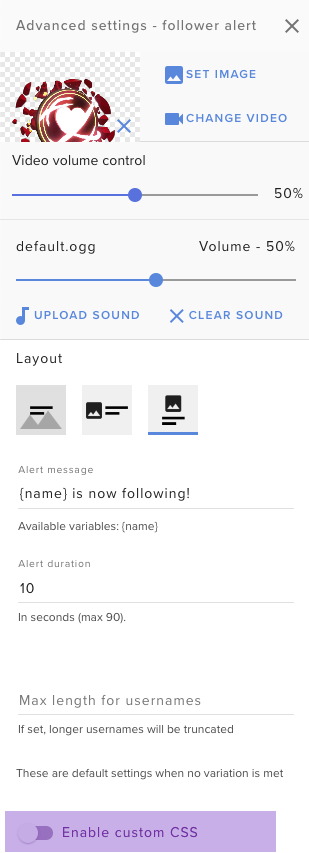
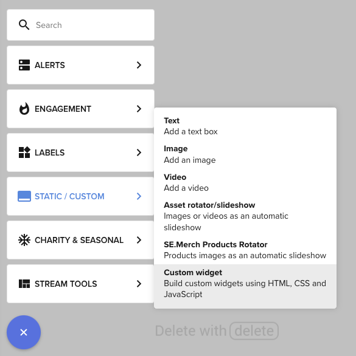

# Before Starting

This documentation will demonstrate you how to work with our Overlays and Widgets. We will start by creating an Overlay.
This overlay will contain an Alert Box and Custom Widget we will use in other articles.

## Creating an Overlay
Navigate to the [Overlays](https://streamelements.com/dashboard/overlays) section and click the "NEW OVERLAY" button.

### Alert Box
The Alert Box is a native widget that displays live events from the queue in a popup-like behavior.

To create an alertbox use  button in overlay editor and select "AlertBox" in ALERTS section

#### Enabling Custom code for alert box
You can enable custom code for alert box by toggling the "Enable custom CSS" option for alert type you want to use.
For example open options for alertbox, go to "Followers" tab and enable custom code as on screenshot below

### Custom Widget
The Custom Widget is a native widget that you can use to display any content you want.
It is a good way to display your own content in overlay. It can consume local events (like tips, follows etc.) as well
as remote events read from a websocket or from a REST API.

To create a custom widget use  button in overlay editor and select "Custom Widget" in STATIC/CUSTOM section
